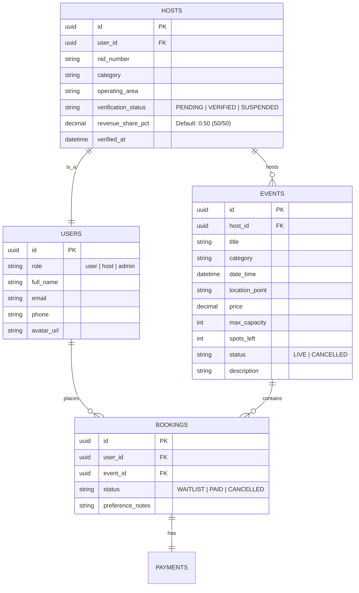

# Combined Inventor's Note & Platform Feature Roadmap

This document combines the technical design guidelines and platform roadmap features:
- **Source 1:** [inventors_note.md](file:///c:/Users/Sumon/Desktop/Concept/inventors_note.md)
- **Source 2:** [platform_feature_list.md](file:///c:/Users/Sumon/Desktop/Concept/platform_feature_list.md)

---

# PART 1: Inventor's Note: Shifting to Host-Driven Marketplace

**To the Implementing Developer:**

This note acts as the design handoff for translating the `index.html` UI blueprint into the live Python FastAPI + Neon PostgreSQL + Google Container Registry (GCR) system. 

The platform is transitioning from self-hosted events to a verified **Host-Driven Marketplace**.

---

## 1. User Base Role System

Define access policies and decorators around these three user roles:

1. **User (Attendee)**:
   - *Description*: Standard client account.
   - *Capabilities*: Can browse experiences, sign up for events, join waiting lists for sold-out events, pay via gateway integration, and view their active ticket reservations.

2. **Host (Community Partner)**:
   - *Description*: Verified event organizers.
   - *Capabilities*: Can request host verification (submitting NID details), publish events (which are queued until verified), manage their created events, view active registries, and **promote waitlisted attendees** to active slots. They receive a **50/50 revenue share split**.

3. **Admin (System Operator)**:
   - *Description*: DekhaHok platform team.
   - *Capabilities*: Can approve/suspend hosts, moderate the live events discovery feed, audit ticket bookings & payouts ledger, **navigate/transfer users across events**, and manually **promote waitlisted tickets** on behalf of users.

---

## 2. Database Schema Additions (Neon PostgreSQL)

Update the database models (via Alembic migrations) as follows:



---

## 3. Waiting List Transaction Logic (FastAPI)

Implement waiting list promotions carefully. When a spot becomes free (due to capacity expansion, cancellation, or transfer) or when a host promotes a waitlisted user, the promotion must run inside a secure transaction.

### Waitlist Promotion Code Pattern:
```python
@router.post("/events/{event_id}/bookings/{booking_id}/promote")
async def promote_attendee(
    event_id: UUID,
    booking_id: UUID,
    db: Session = Depends(get_db),
    current_user: User = Depends(get_current_active_host_or_admin)
):
    with db.begin():  # Safe Neon PostgreSQL transaction
        # Lock target booking
        booking = db.query(Booking).filter(
            Booking.id == booking_id, 
            Booking.event_id == event_id
        ).with_for_update().first()
        
        if not booking:
            raise HTTPException(status_code=404, detail="Booking not found")
        if booking.status != "WAITLIST":
            raise HTTPException(status_code=400, detail="Attendee is not in waitlist status")

        # Lock event
        event = db.query(Event).filter(Event.id == event_id).with_for_update().first()
        if not event or event.status != "LIVE":
            raise HTTPException(status_code=404, detail="Event not active")

        # Set status to PAID and deduct spot (or override if host increases capacity)
        booking.status = "PAID"
        event.spots_left = max(0, event.spots_left - 1)

        # Trigger payment collection flow or log free ticket promo
        # dispatch_waitlist_promotion_email_and_whatsapp(booking)

    return {"status": "success", "message": "Attendee promoted to active registration"}
```

---

## 4. Git Branching & CI/CD (GitHub + GCR)

1. **Branching**: Spin up a new branch `feature/host-driven-marketplace` off `main`.
2. **Neon DB**: Create a temporary branch database in Neon for developer environment isolated testing.
3. **CI/CD**: Ensure the Dockerfile builds the new dependencies. Deploy staging image via Google Container Registry (GCR) to Cloud Run or GKE for preview.

---

# PART 2: DekhaHok Platform Upgrade: Feature Roadmap & Blueprint

This list categorizes the necessary work packages to evolve DekhaHok from a self-hosted event platform to an automated, host-driven marketplace.

---

## 🏗️ Phase 1: Authentication & User Roles
- [ ] **Role-Based Routing (`user` | `host` | `admin`)**:
  - `user`: Browse events, book spots, and request waitlist entry.
  - `host`: Creator dashboard, event compiler tool, payout tracker.
  - `admin`: Verification desk, discovery feed moderator, booking ledger auditor.
- [ ] **Optional Email Verification**: Make email address collection optional during booking to lower checkout friction, but require Google or Verified Email login for hosts.
- [ ] **NID Submission & Security**: Create a secure upload pipeline for national identification cards (NID) to run trust evaluations.

---

## 🧭 Phase 2: Host Operations & Verification Flow
- [ ] **Multi-Step Onboarding Form**:
  - Step 1: Personal profile, avatar, email, category dropdown (Creative, Professional, Lifestyle, Cafe Explorer, Tours, etc.).
  - Step 2: Policy acceptance page. Displays the 50/50 revenue split model clearly.
  - Step 3: Initial Event creation.
  - Step 4: Verification status check.
- [ ] **Host Verification Status Engine**:
  - `PENDING`: Application submitted, event created but hidden from public feeds.
  - `VERIFIED`: Discovers host and shows their events publicly.
  - `SUSPENDED`: Disables public view of all host events.

---

## 🎨 Phase 3: Host Creator Dashboard
- [ ] **Real-time Event Builder**: Allows hosts to publish detailed itineraries, dates, capacities, prices, and meeting point coordinates.
- [ ] **Attendee & Waiting List Registry**:
  - Hosts can view active bookings (paid tickets) and **waitlist bookings**.
  - **Waitlist Promote Button**: Allows hosts to promote waitlisted attendees manually to the active registry.
- [ ] **Financial Ledger**:
  - Display gross monthly ticket earnings.
  - Apply the **50/50 platform-host split** automatically before showing payable host balance.
  - Log payout history (via bKash / bank transfer details).

---

## 🛠️ Phase 4: Admin Control Panel
- [ ] **Host Verification Pipeline**: Portal to review pending applications, inspect NID digits, and verify/suspend profiles.
- [ ] **Discovery Feed Moderation**: Cancel policy-violating events or pin featured ones.
- [ ] **Booking Ledger Audit & Gateways**: Real-time payment verification portal.
- [ ] **Administrative Ticket Transfer Engine**:
  - Interactively select any booking and choose to move the attendee to another live event.
- [ ] **Global Waitlist Promotor**:
  - Portal for admins to promote waitlisted tickets, resolve disputes, or clear queues.

---

## 🎫 Phase 5: Ticket Booking & Payment Gateways
- [ ] **Multipass Payment Integration**: Link checkout with bKash, Nagad, and Credit Cards via SSLCommerz.
- [ ] **Automated Waitlisting for Sold-out Events**: If spots are 0, dynamically change booking flow to "Waitlist mode" (৳0 checkout).
- [ ] **Anti-dating Code of Conduct Gate**: Require users to check checkboxes certifying understanding of the strictly non-dating, activity-focused nature of the platform before placing payment.
- [ ] **WhatsApp Confirmation Integration**: Dispatch automated WhatsApp receipts, Ticket IDs, and Google Maps meeting locations immediately upon successful webhook payment signal.

---

## 🚀 Phase 6: DekhaHok Passport (Coming Soon)
- [ ] **Subscription Engine**: Support recurring monthly billing (e.g., ৳499) for the Passport program.
- [ ] **Tokenized Ticketing**: Passport holders receive 1 free booking token per month.
- [ ] **Priority Booking Engine**: Allow Passport users early access to events that are "Filling Fast" (5 or fewer spots remaining).
